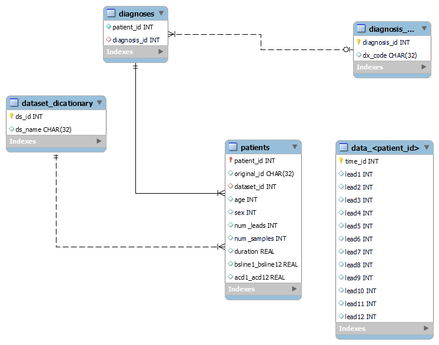
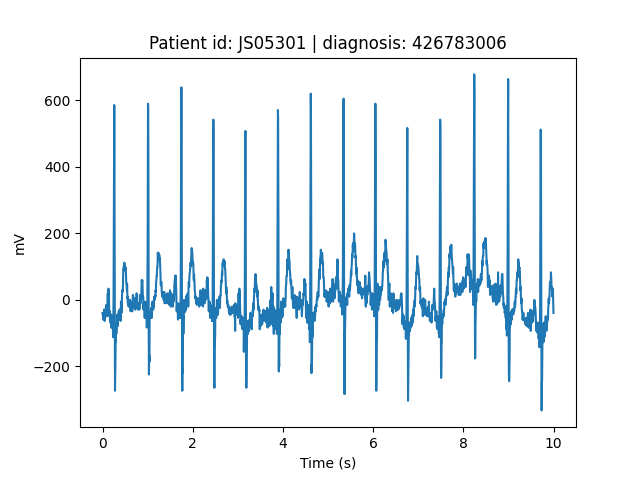

# ECG to SQL


ECG to SQL is a collection of python scripts to store electrocardiography (ECG) data into an SQLite database. 
The data used to develop this repo are provided by the [PhysioNet/CinC challenge 2021](https://physionet.org/content/challenge-2021/1.0.0/) on
the detection of atrial fibrillation.

The database structure is mainly based on the online analytical processing (OLAP) approach with the following entity 
relationship diagram. 


To ensure data integrity during entries insertion and minimize data redundancy, the design of this dataset
satisfies the first three [normal form rules](https://en.wikipedia.org/wiki/Database_normalization).
The ecg time series were stored into a single table per patient.


## Usage
Aggregate all the metadata in csv files, one for each dataset

```python
from data_access.prepare import prepare_summary_csv

prepare_summary_csv()
```
Create and populate the dataset
```python
from create_db import CreateDb
from pathlib import Path
from parameters import DefaultArguments

data_dir = Path('./path')
builder = CreateDb(data_dir, db_file_name='af_detection.db')

builder.populate_schema(dataset_name=DefaultArguments.ChapmanShaoxing)
builder.populate_data_tables(dataset_name=DefaultArguments.ChapmanShaoxing)
builder.db.close()
```

Load the dataset and retrieve one patient data
```python
from load_db import LoadDb
from pathlib import Path
import matplotlib.pyplot as plt
import numpy as np

data_dir = Path('./path')
loader = LoadDb(data_dir=data_dir, 
                db_file_name='af.db')

original_id, diagnosis = loader.get_single_patient_data(patient_id=42)
ecg = loader.get_ecg(patient_id=42, leads=[1])

time = np.array(list(range(len(ecg)))) / loader.SAMPLING_FREQUENCY
plt.title(f'Patient id: {original_id} | diagnosis: {diagnosis}')
plt.xlabel('Time (s)')
plt.ylabel('mV')
plt.plot(time, ecg)
```



## License
Distributed under the MIT License. See `LICENSE.txt` for more information.

## Contact
Gaetano Scebba - [@GScebba](https://twitter.com/GScebba)

## Acknowledgments
* [PhysioNet/CinC challenge 2021](https://physionet.org/content/challenge-2021/1.0.0/)
